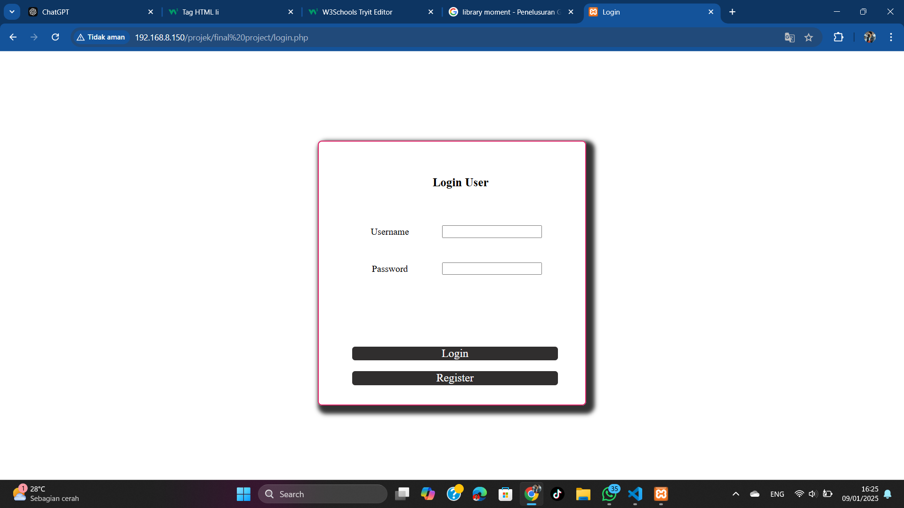
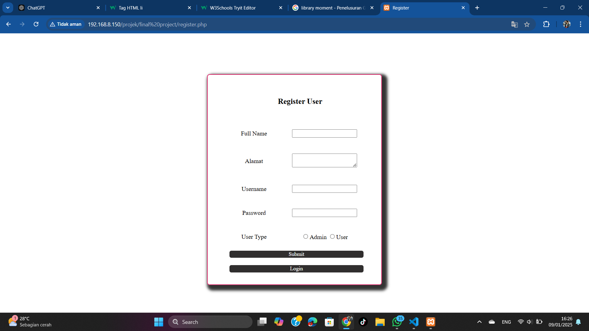
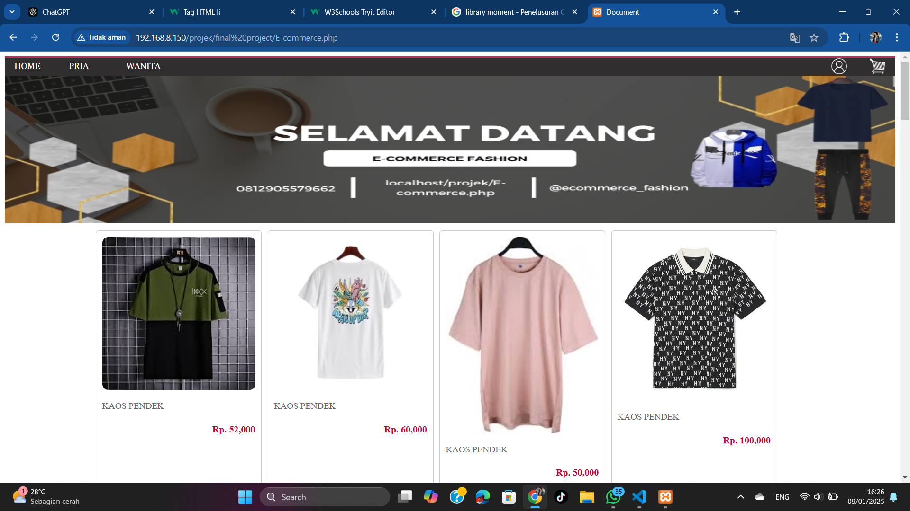
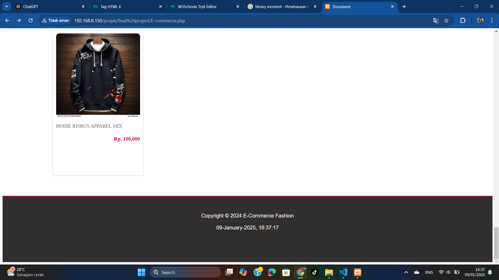
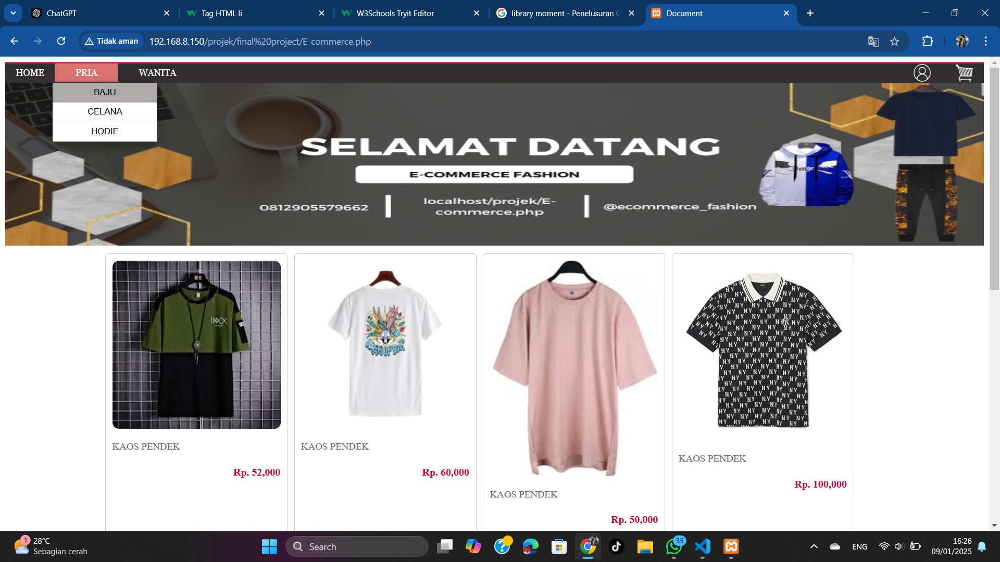
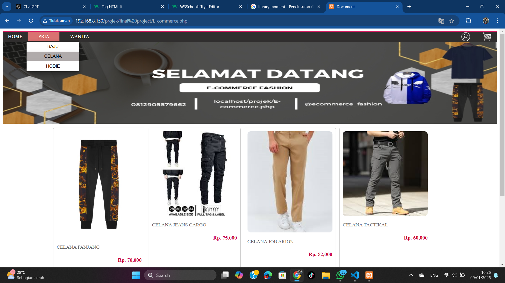
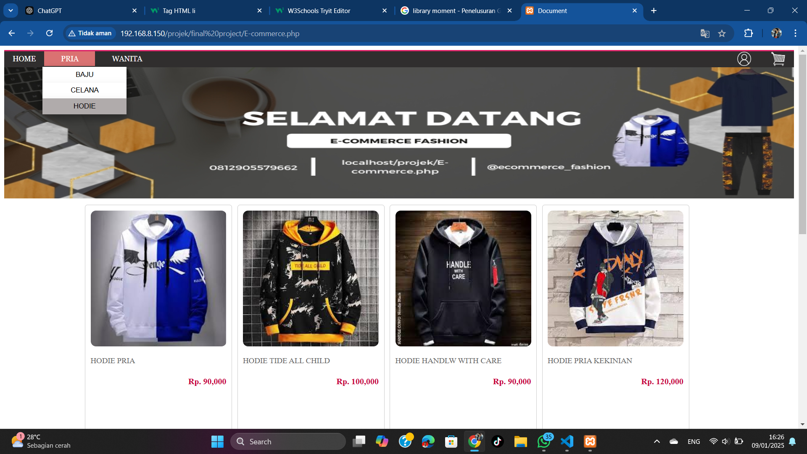
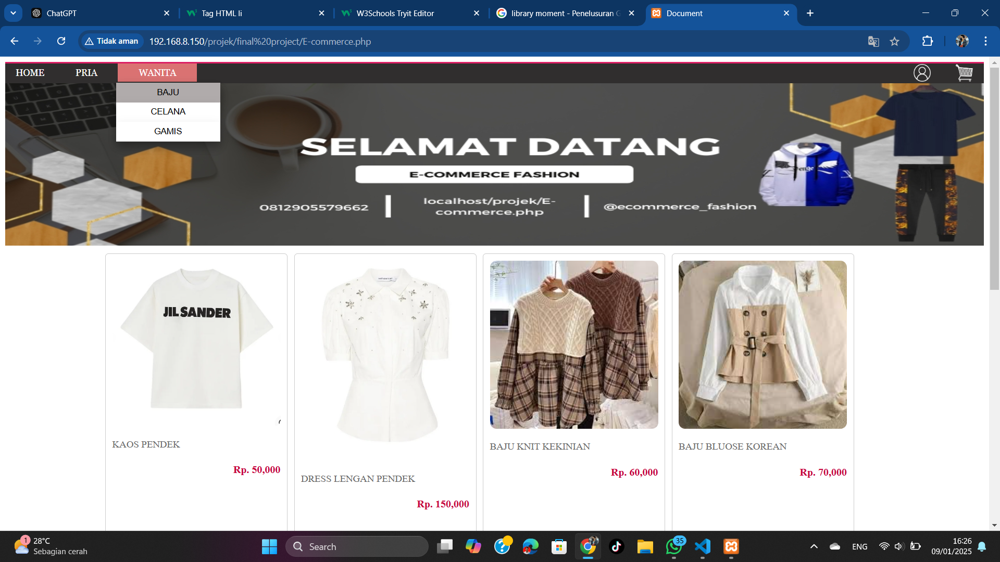
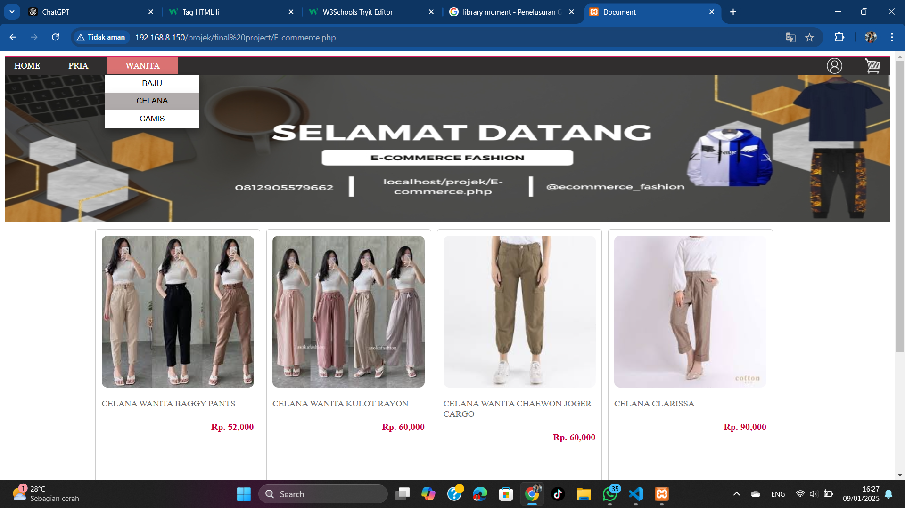
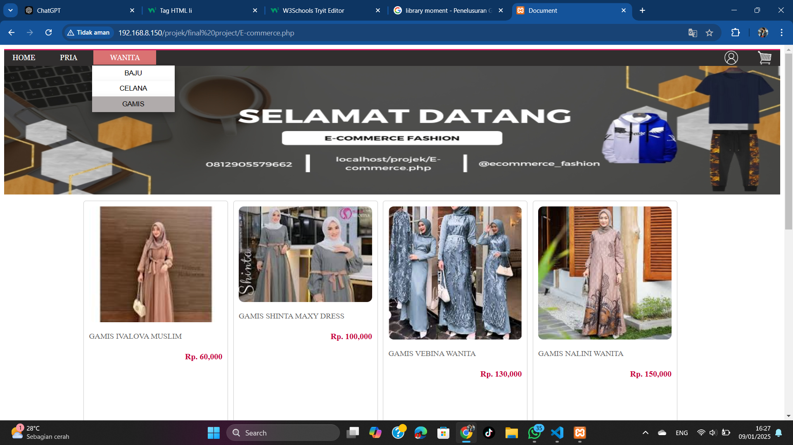

# E-Commerce Fashion

## Pengenalan Project

Project ini bertujuan untuk mengembangkan sebuah platform e-commerce berbasis web yang khusus menjual produk fashion, baik untuk pria maupun wanita. Website ini dirancang untuk memberikan pengalaman belanja yang mudah, cepat, dan nyaman bagi pelanggan, serta memungkinkan para penjual atau brand fashion untuk memasarkan produk mereka dengan efektif. Dengan menganalisa kebutuhan user (pengguna untuk berbelaja) dan admin (pengguna yang dapat mengelola produk dan berjualan) kami berhasil menciptakan sebuah platform ini yang diharapkan dapat menjadi solusi utama bagi mereka yang ingin membeli pakaian atau menjual pakaian secara online.

<table>
<ul>
<strong>Fitur-Fitur Utama :</strong>
<li>Tampilan Produk Lengkap: Setiap produk akan dilengkapi dengan foto yang jelas,klik produk untuk deskripsi detail, deskripsi detail, ukuran yang tersedia.</li>
<li>Sistem Keranjang Belanja: Pengguna dapat menambah produk ke dalam keranjang dan melanjutkan ke pembayaran dengan mudah.</li>
<li>Filter Pencarian: Pengguna dapat mencari produk berdasarkan kategori yang tersedia termasuk gender/jenis kelamin dengan mudah</li>
<li>Akun Pengguna: Pengguna dapat membuat akun untuk melakukan pembelian, menyimpan alamat pengiriman, selain itu pengguna khusus dapat mendaftarkan diri sebagai admin untuk bisa mengelola produk.</li>
</ul>  

<ul>
<strong>Teknologi yang Digunakan:</strong>

<li>Frontend: HTML, CSS, JavaScript, dan penggunaan library jquery untuk dapat membuat web lebih responsif seperti penggunaan teknologi ajax selain itu penggunaan library moment untuk mengatur format jam yang datanya diambil menggunakan API.</li>
<li>Backend: PHP untuk pengelolaan server dan basis data.</li>
<li>Database: MySQL untuk penyimpanan data produk, pengguna dan keranjang.</li>
</ul>
</table>

Dengan project ini, kami bertujuan untuk menciptakan sebuah platform yang tidak hanya memenuhi kebutuhan pelanggan dalam membeli produk fashion secara online, tetapi juga memberikan pengalaman berbelanja yang mudah dan nyaman.

## Nama Kelompok
<table border="1">
  <thead>
    <tr>
      <td>No</td>
      <td>NIM</td>
      <td>Nama Anggota</td>
    </tr>
  <thead>
  <tbody>
    <tr>
      <td>1</td>
      <td>19235014</td>
      <td>Dimas Mulyadi</td>
    </tr>
    <tr>
      <td>2</td>
      <td>19235156</td>
      <td>Rafky Imansyah Siahaan</td>
    </tr>
    <tr>
      <td>3</td>
      <td>19235079x</td>
      <td>Muchammad  Rizki Nugroho</td>
    </tr>
   
  </tbody>
</table>

## Skenario Kebutuhan Pengguna
<strong>Pengguna</strong>
<ol>
<li>Menu kategori produk yang memudahkan pengguna</li>
<li>Menu untuk mengelola akun dengan mudah</li>
<li>Menu keranjang untuk menampung produk jika ingin membelinya nanti</li>
<li>Menu pembelian</li>
</ol>

<strong>Admin</strong>
<ol>
<li>Mengelola produk (untuk menambah atau menghapus produk)</li>
<li>Mengelola akun</li>
</ol>
<!-- Sesuaikan dengan hak akses dari project masing-masing kelompok -->

## Screenshot
<table width="100%" align="center">
<tr>
<td><h3 align="center">Login</h3></td>
<td><h3 align="center">Register</h3></td>
</tr>
<tr>
<td><h3 align="center">Menu Home</h3></td>
<td><h3 align="center">Menu Home</h3></td>
</tr>
<tr>
<td><h3 align="center">Menu Baju Pria</h3></td>
<td><h3 align="center">Menu Celana Pria</h3></td>
<td><h3 align="center">Menu Hodie Pria</h3></td>
</tr>
<tr>
<td><h3 align="center">Menu Baju Wanita</h3></td>
<td><h3 align="center">Menu Celana Wanita</h3></td>
<td><h3 align="center">Menu Gamis Wanita</h3></td>
</tr>
</table>

## Lisensi

Project ini dibuat untuk menyelesaikan project mata kuliah Web Programming II Universitas Bina Sarana Informatika (UBSI) yang diampu oleh Bpk. <a href="https://github.com/yuris60">Yuris Alkhalifi, M.Kom., CPDSA</a> selaku Dosen. Project ini bersifat open source untuk edukasi.
<!-- Kalian boleh mengubah bentuk lisensi ini sesuai kesepakatan kelompok apakah akan bersifat open source atau tidak -->
<blockquote>Kuliah...? BSI AJA !!</blockquote>

